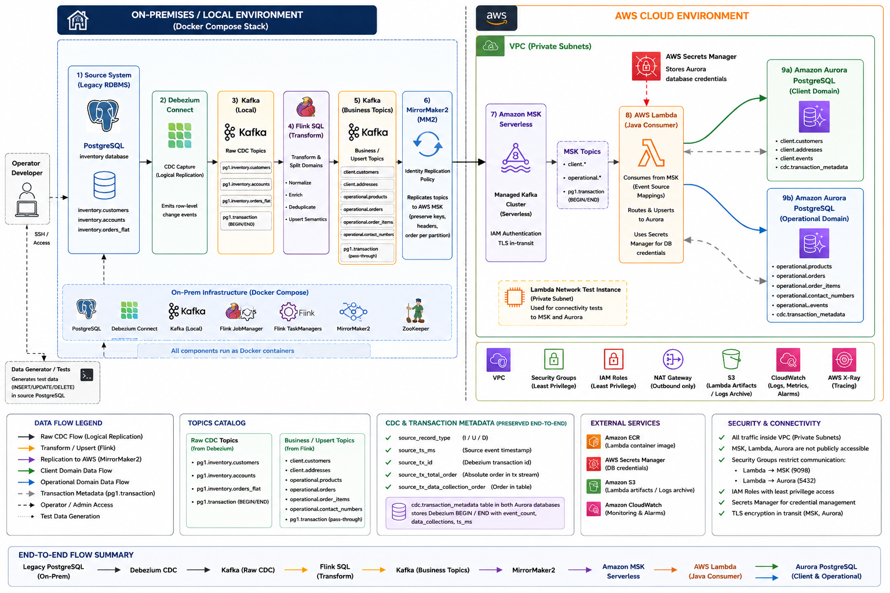
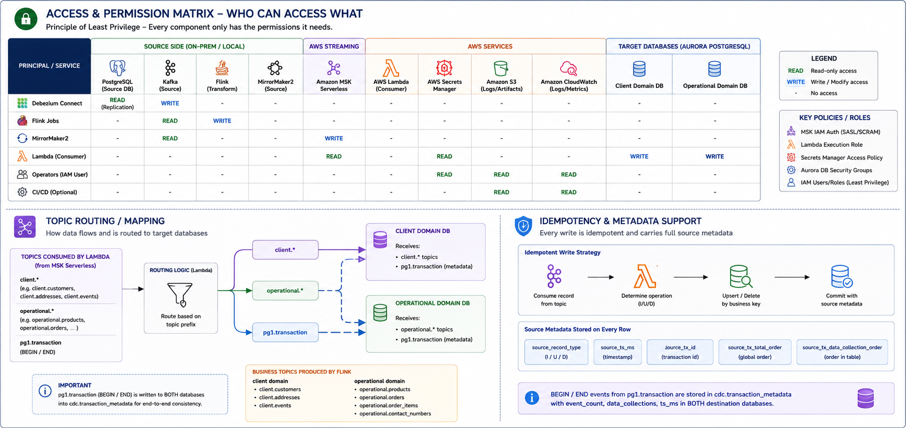

# Kafka CDC Replication to MSK and Aurora

This project provisions an AWS environment that mirrors the same logical flow as the local split deployment: source CDC and transformations on EC2, replication to MSK, then fan-out writes into separate client and operational Aurora PostgreSQL databases via Lambda.

This is a prototype built with an example inventory/customer/order dataset. Its main purpose is to demonstrate a real-time data flow for migrating a staging persistence layer from on-premises systems toward a service-oriented architecture. The pattern can support phased modernization workflows such as canary releases, blue/green deployments, reporting projections, audit stores, domain-specific read models, and other downstream systems that need live, consistent change streams during migration.

The AWS environment uses the public EC2 instance as an on-premises infrastructure emulator. The main flow is:

1. The EC2 instance runs legacy PostgreSQL, Debezium, Kafka, Flink, Kafka UI, and MirrorMaker2 in Docker.
2. Debezium captures CDC from `inventory.customers`, `inventory.accounts`, and `inventory.orders_flat` into `pg1.inventory.*` topics plus `pg1.transaction`.
3. Flink transforms CDC events into business topics: `client.customers`, `client.addresses`, `operational.products`, `operational.orders`, `operational.order_items`, and `operational.contact_numbers`.
4. MirrorMaker2 replicates `client.*`, `operational.*`, and `pg1.transaction` from EC2 Kafka to MSK Serverless using IAM authentication.
5. A Java Lambda function is triggered from those MSK topics.
6. Lambda writes to two Aurora targets: client DB (`client.*`) and operational DB (`operational.*`), and stores transaction metadata (`pg1.transaction`) in both.

## Architecture



The Terraform configuration creates:

- A VPC with two public subnets and two private subnets.
- An Internet Gateway and NAT Gateway.
- An MSK Serverless cluster with IAM client authentication.
- Two Aurora PostgreSQL clusters in private subnets (client and operational).
- A public EC2 host that emulates on-prem infrastructure with Docker, PostgreSQL, Debezium, Kafka, Flink, Kafka UI, and MirrorMaker2.
- A private EC2 network-test host.
- A Java 17 Lambda function connected to the private subnets.
- MSK event source mappings that invoke Lambda from `pg1.transaction`, `client.*`, and `operational.*` topics.
- IAM roles and security groups for EC2, MSK, Lambda, and Aurora.

The diagram shows the EC2 host as the source-side infrastructure emulator. It runs the legacy PostgreSQL database, Debezium CDC, local Kafka, Flink SQL transformations, Kafka UI, and MirrorMaker2 containers. AWS keeps the managed target side private: MSK Serverless, Lambda, and both Aurora PostgreSQL clusters run inside the VPC path, with Secrets Manager providing database credentials.

## Permissions, Topics, and Idempotency



The pipeline is split by topic prefix:

- `client.*` topics are routed to the client Aurora database.
- `operational.*` topics are routed to the operational Aurora database.
- `pg1.transaction` is written to `cdc.transaction_metadata` in both destination databases.

Every derived business topic keeps source metadata from the Debezium event stream: `source_record_type`, `source_ts_ms`, `source_tx_id`, `source_tx_total_order`, and `source_tx_data_collection_order`. Lambda uses topic prefix routing and business keys to upsert or delete destination rows idempotently while preserving the transaction metadata needed for replay, audit, and consistency checks.

## Repository Layout

```text
.
├── aurora.tf                 # Aurora PostgreSQL cluster and instance
├── charts/                   # Architecture, local flow, permissions, and topic diagrams
├── ec2.tf                    # EC2 hosts, IAM role, and user data wiring
├── iam-terraform-deployer-user.yaml # Optional IAM bootstrap stack for Terraform user setup
├── lambda.tf                 # Java Lambda function and MSK event source mapping
├── msk.tf                    # MSK Serverless cluster
├── network.tf                # VPC, subnets, routes, NAT, and Internet Gateway
├── outputs.tf                # Terraform outputs
├── providers.tf              # Terraform and AWS provider configuration
├── security.tf               # Security groups
├── scripts/
│   ├── connect-kafka-mm2.sh   # macOS/Linux helper for EC2 Instance Connect SSH
│   ├── connect-kafka-mm2.bat  # Windows helper for EC2 Instance Connect SSH
│   └── msk/
│       ├── msk-up.sh              # Enable MSK resources for cloud validation windows
│       ├── msk-down.sh            # Disable MSK resources to stop MSK Serverless cost
│       └── analyze-msk-cost-window.sh # Cost and lifecycle analysis for MSK
├── user_data.sh.tpl          # EC2 bootstrap script for Kafka and MirrorMaker2
├── variables.tf              # Input variables
├── local/                    # Local Docker integration stack, scripts, and component tests
│   ├── scripts/              # Local deployment and E2E helpers
│   └── tests/                # Component-level local stack checks
├── tmp/lambda_test.sh        # Manual Lambda invoke helper
└── lambda_java/
    ├── build.gradle          # Java Lambda build configuration
    ├── gradlew               # Gradle wrapper for macOS/Linux
    ├── gradlew.bat           # Gradle wrapper for Windows
    └── src/main/java/com/example/Handler.java
```

## Prerequisites

- Terraform `>= 1.5.0`
- AWS CLI configured with credentials for the target account
- Java 17
- Docker and Docker Compose v2 for local validation
- `jq` for the AWS E2E script
- Network access to AWS APIs
- Permissions to create VPC, EC2, MSK, RDS, Lambda, IAM, Secrets Manager, CloudWatch Logs, S3, KMS decrypt grants, and related resources

This project creates billable AWS resources, including NAT Gateway, EC2, MSK Serverless, Aurora, Lambda, and data transfer.

## Local Integration Stack

The legacy single-stack proof of concept validates the first part of the CDC pipeline before using AWS:

```text
local legacy PostgreSQL
  -> Debezium PostgreSQL CDC connector
  -> local Kafka CDC topic
  -> Flink SQL projection job
  -> local target PostgreSQL
```

Start it from the repository root:

```bash
docker compose -f examples/legacy-single-stack-poc/docker-compose.yml up -d
```

The stack is defined in `examples/legacy-single-stack-poc/docker-compose.yml` and reuses local CDC assets from `local/`: one-shot PostgreSQL init, one-shot Debezium connector registration, Flink connector JAR mounting, Kafka UI, and a basic Flink SQL projection into target PostgreSQL. See `local/README.md` for topic checks, source-change commands, and cleanup steps.

## Local Two-Compose Migration Emulation


For local development without MSK, Lambda, or Aurora, Terraform can start a split Docker deployment:

```text
source compose:
  PostgreSQL -> Debezium CDC -> Kafka -> Flink -> client.* and operational.* Kafka topics -> MirrorMaker2

cloud replacement compose:
  Kafka -> local Lambda replacement -> client PostgreSQL + operational PostgreSQL
```

The local split flow preserves Debezium transaction metadata by replicating `pg1.transaction`, adding source transaction fields to every derived topic, and storing them on destination tables for consistency checks, replay, and deduplication.

Run it with Terraform:

```bash
terraform apply \
  -var enable_local_deployment=true \
  -target=terraform_data.local_docker_network \
  -target=terraform_data.local_cloud_deployment \
  -target=terraform_data.local_source_deployment
```

Run a delivery test:

```bash
./local/scripts/run-local-e2e.sh
```

Start or stop the split local deployment without running the E2E assertions:

```bash
./local/scripts/start-local.sh
./local/scripts/stop-local.sh
DELETE_VOLUMES=1 ./local/scripts/stop-local.sh
```

Reset both local compose stacks and rerun from a clean slate:

```bash
RESET=1 ./local/scripts/run-local-e2e.sh
```

Run component checks separately after the local stack is up:

```bash
./local/tests/test-source-postgres.sh
./local/tests/test-debezium-connect.sh
./local/tests/test-source-kafka.sh
./local/tests/test-flink.sh
./local/tests/test-mirrormaker2.sh
./local/tests/test-cloud-kafka.sh
./local/tests/test-client-postgres.sh
./local/tests/test-operational-postgres.sh
./local/tests/test-local-lambda.sh
```

Run all component checks:

```bash
./local/tests/run-all-components.sh
```

The source compose lives in `local/source/docker-compose.yml`; the cloud replacement compose lives in `local/cloud/docker-compose.yml`. See `local/README.md` for verification commands.

## AWS Account Preparation

Use a dedicated AWS account or sandbox account when possible. At minimum, prepare these items before running Terraform:

1. Choose an AWS region. The default is `us-east-1`.
2. Confirm the AWS CLI identity that will run Terraform:

```bash
aws sts get-caller-identity
```

3. Bootstrap a deployer IAM user or role with permissions for this project. This repository includes `iam-terraform-deployer-user.yaml`, a CloudFormation template that creates a scoped IAM user named `terraform` by default and attaches permissions for the VPC, EC2, MSK, RDS/Aurora, Lambda, IAM roles, Secrets Manager, CloudWatch, Cost Explorer, CloudTrail lookup, and EC2 Instance Connect actions used by the project.

```bash
aws cloudformation deploy \
  --region us-east-1 \
  --stack-name kafka-mm2-msk-lab-terraform-user \
  --template-file iam-terraform-deployer-user.yaml \
  --capabilities CAPABILITY_NAMED_IAM \
  --parameter-overrides \
    TerraformUserName=terraform \
    ProjectPrefix=kafka-mm2-msk-lab \
    CreateAccessKey=false
```

4. Configure AWS CLI credentials for the selected deployer identity. Prefer IAM Identity Center, role assumption, or manually managed short-lived credentials. If you intentionally need CloudFormation to create an access key for a disposable lab account, set `CreateAccessKey=true` and store the returned secret securely.
5. Make sure required service-linked roles can be created on first use. The bootstrap policy allows service-linked role creation for Auto Scaling, MSK, Lambda, and RDS.
6. Set your public IP as the SSH allowlist before applying EC2 resources:

```bash
export TF_VAR_ssh_cidr=<your-public-ip>/32
```

You can detect your current public IP with:

```bash
curl -fsS https://checkip.amazonaws.com
```

The helper scripts can also detect or accept your public IP and set `TF_VAR_ssh_cidr` automatically.

## Configuration

The main variables are defined in `variables.tf`:

- `aws_region`: AWS region, default `us-east-1`
- `enable_msk`: controls MSK Serverless + Lambda MSK event mappings, default `false`
- `project`: resource name prefix, default `kafka-mm2-msk-lab`
- `ec2_instance_type`: EC2 host type, default `t3.large`
- `ec2_root_volume_size`: root EBS volume size for the EC2 source emulator, default `80`
- `ec2_msk_bootstrap_iam`: optional MSK IAM bootstrap string for MirrorMaker2 on EC2
- `ssh_cidr`: allowed CIDR for SSH and optional Kafka test access, default `0.0.0.0/32`
- `ec2_instance_connect_user_name`: IAM user allowed to push temporary EC2 Instance Connect SSH keys, default `terraform`
- `db_name`: legacy variable retained for backward compatibility
- `db_username`: Aurora master username, default `appuser`
- `client_db_name`: Aurora client database name, default `clientdb`
- `operational_db_name`: Aurora operational database name, default `operationaldb`
- `aurora_instance_class`: Aurora instance class, default `db.t3.medium`
- `mm2_topic_allowlist_regex`: MM2 replication allowlist, default `(operational[.].*|client[.].*|pg1[.]transaction)`
- `mm2_group_allowlist_regex`: MM2 group sync allowlist, default `__no_groups__`
- `enable_local_deployment`: starts the local two-compose Docker deployment, default `false`
- `local_docker_network_name`: shared Docker network for local source and cloud emulator stacks, default `cdc-migration-local`

Set `ssh_cidr` to your current public IP in CIDR form before applying. Terraform also reads this automatically from the `TF_VAR_ssh_cidr` OS environment variable.

```bash
export TF_VAR_ssh_cidr=<your-public-ip>/32
terraform apply
```

MSK is disabled by default to reduce cost. Enable it only for short validation windows:

```bash
./scripts/msk/msk-up.sh us-east-1
```

Disable MSK resources after validation:

```bash
./scripts/msk/msk-down.sh us-east-1
```

Analyze MSK cost and lifecycle events for a time window:

```bash
./scripts/msk/analyze-msk-cost-window.sh 2026-05-10 2026-05-14 us-east-1
```

Notes:
- Exact cluster create/delete timestamps require IAM permission `cloudtrail:LookupEvents`.
- Hour-level Cost Explorer granularity requires payer-account CE hourly opt-in; without it, charge windows are day-level.

The helper scripts below set `TF_VAR_ssh_cidr` before Terraform runs. They accept the IP as an argument, or read it from `MY_IP`, `PUBLIC_IP`, or `TF_VAR_ssh_cidr`.

## Build Lambda

Build the Java Lambda fat JAR before running Terraform apply:

```bash
cd lambda_java
./gradlew clean build
cd ..
```

Terraform expects the JAR at:

```text
lambda_java/build/libs/msk-to-aurora-lambda-1.0.0.jar
```

## Deploy

Initialize and apply Terraform:

```bash
terraform init
terraform plan
terraform apply
```

Important outputs include:

- `vpc_id`
- `ec2_public_ip`
- `ec2_instance_id`
- `ec2_private_ip`
- `lambda_net_test_private_ip`
- `msk_bootstrap_sasl_iam`
- `aurora_client_endpoint`
- `aurora_operational_endpoint`
- `msk_cluster_arn`
- `aurora_client_master_secret_arn`
- `aurora_operational_master_secret_arn`
- `aurora_port`
- `sg_lambda_id`
- `sg_msk_id`
- `subnet_private_ids`

## Demo: Connect to EC2 with EC2 Instance Connect

The public EC2 host is `aws_instance.kafka_mm2`. SSH access is restricted by the `ssh_cidr` Terraform variable, so pass your public IP as a parameter when creating or updating the instance.

Run on macOS/Linux. If no IP is provided, the script uses `https://checkip.amazonaws.com` to detect your current public IPv4 address:

```bash
./scripts/connect-kafka-mm2.sh
```

You can also set an OS environment variable before running the script:

```bash
export MY_IP=<your-public-ip>
./scripts/connect-kafka-mm2.sh
```

Or pass the IP explicitly:

```bash
./scripts/connect-kafka-mm2.sh <your-public-ip> us-east-1 ~/.ssh/temp_ec2_key
```

Run on Windows. If no IP is provided, the script also attempts to detect it:

```bat
scripts\connect-kafka-mm2.bat
```

On Windows, you can set the OS environment variable before running Terraform:

```bat
set MY_IP=<your-public-ip>
scripts\apply-ec2-access.bat
```

The scripts:

1. Detect or accept your public IP and convert it to CIDR form, for example `<your-public-ip>/32`.
2. Create a temporary SSH key if it does not already exist.
3. Set `TF_VAR_ssh_cidr=<your-ip>/32` before Terraform runs.
4. Apply the targeted EC2 resources and EC2 Instance Connect IAM policy.
5. Read `ec2_instance_id` and `ec2_public_ip` from Terraform outputs.
6. Send the public key with `aws ec2-instance-connect send-ssh-public-key`.
7. Open SSH as `ec2-user`.

Equivalent manual commands:

```bash
export TF_VAR_ssh_cidr=<your-public-ip>/32
terraform apply \
  -target=aws_security_group.ec2 \
  -target=aws_instance.kafka_mm2 \
  -target=aws_iam_user_policy.ec2_instance_connect

aws ec2-instance-connect send-ssh-public-key \
  --region us-east-1 \
  --instance-id "$(terraform output -raw ec2_instance_id)" \
  --instance-os-user ec2-user \
  --ssh-public-key file://~/.ssh/temp_ec2_key.pub

ssh -i ~/.ssh/temp_ec2_key ec2-user@"$(terraform output -raw ec2_public_ip)"
```

## EC2 Bootstrap

The main EC2 host uses `user_data.sh.tpl` to emulate the on-premises side of the migration:

- Install Docker.
- Install Docker Compose v2.
- Download the AWS MSK IAM auth JAR.
- Download Flink Kafka, JSON, JDBC, and PostgreSQL connector JARs.
- Create local legacy PostgreSQL init scripts.
- Start local PostgreSQL with logical replication enabled.
- Register a Debezium PostgreSQL CDC connector.
- Start local Kafka and Zookeeper.
- Start Flink JobManager, TaskManager, and a Flink SQL projection job that writes `client.*` and `operational.*` topics with source transaction metadata.
- Start Kafka UI.
- Write Kafka client configuration for IAM auth.
- Write MirrorMaker2 configuration.
- Create `/opt/lab/docker-compose.yml`.
- Start MirrorMaker2 to replicate `client.*`, `operational.*`, and `pg1.transaction` to MSK Serverless.
- Install a `lab-up.service` systemd unit for restarting the Docker stack.

On the EC2 host, useful paths are:

```text
/opt/lab/docker-compose.yml
/opt/lab/mm2.properties
/opt/lab/client.properties
/opt/lab/postgres/init
/opt/lab/connectors
/opt/lab/flink/sql/init.sql
/opt/lab/integration-test-cdc-to-kafka.sh
/usr/local/bin/lab-up.sh
/var/log/user-data.log
```

Useful EC2 emulator ports are restricted by `ssh_cidr`:

- `9092`: local Kafka
- `8080`: Kafka UI
- `8081`: Flink UI
- `8083`: Debezium Connect REST API

## EC2 CDC to Kafka Test

The EC2 bootstrap creates `/opt/lab/integration-test-cdc-to-kafka.sh`. The test inserts one row into `inventory.customers` in the source PostgreSQL container and verifies that Debezium publishes the change to Kafka topic `pg1.inventory.customers`.

After connecting to the EC2 host:

```bash
sudo /opt/lab/integration-test-cdc-to-kafka.sh
```

Optional parameters can be set as environment variables:

```bash
sudo env CUSTOMER_ID=10001 \
  EMAIL=cdc-test-10001@example.com \
  TIMEOUT_SECONDS=180 \
  /opt/lab/integration-test-cdc-to-kafka.sh
```

For an EC2 instance created before this script was added, copy and run the repository version:

```bash
./scripts/install-ec2-cdc-test.sh

ssh -i ~/.ssh/temp_ec2_key ec2-user@$(terraform output -raw ec2_public_ip) \
  'sudo /opt/lab/integration-test-cdc-to-kafka.sh'
```

If the test script is already installed, refresh the temporary EC2 Instance Connect key and run it:

```bash
./scripts/run-ec2-cdc-test.sh
```

EC2 Instance Connect SSH keys are temporary. If you run `scp` manually, first send the key again and copy the file immediately after:

```bash
aws ec2-instance-connect send-ssh-public-key \
  --region us-east-1 \
  --instance-id "$(terraform output -raw ec2_instance_id)" \
  --instance-os-user ec2-user \
  --ssh-public-key file://~/.ssh/temp_ec2_key.pub

scp -o StrictHostKeyChecking=accept-new \
  -i ~/.ssh/temp_ec2_key \
  scripts/ec2-cdc-to-kafka-test.sh \
  ec2-user@$(terraform output -raw ec2_public_ip):/tmp/
```

## Lambda Behavior

The Lambda handler:

- Receives Kafka records from MSK for `pg1.transaction`, `client.*`, and `operational.*`.
- Reads credentials from two RDS-managed Secrets Manager secrets.
- Connects to two Aurora PostgreSQL databases (client and operational) using JDBC.
- Upserts projection rows into destination tables with source and transaction metadata fields.
- Stores transaction metadata from `pg1.transaction` in `cdc.transaction_metadata` on both databases.

The Lambda environment variables are set by Terraform:

- `CLIENT_DB_HOST`
- `CLIENT_DB_PORT`
- `CLIENT_DB_NAME`
- `CLIENT_DB_USER`
- `CLIENT_DB_SECRET_ARN`
- `OPERATIONAL_DB_HOST`
- `OPERATIONAL_DB_PORT`
- `OPERATIONAL_DB_NAME`
- `OPERATIONAL_DB_USER`
- `OPERATIONAL_DB_SECRET_ARN`

## AWS E2E Test

After MSK is enabled and the EC2 host is configured with the current MSK bootstrap endpoint, run the full AWS path validation with:

```bash
./scripts/run-aws-e2e-test.sh us-east-1 ~/.ssh/temp_ec2_key
```

The script inserts a generated test customer/account/order set into the source PostgreSQL container on EC2, verifies the source Kafka topics, verifies mirrored MSK topics, then waits for Lambda to write the expected rows and CDC metadata into both Aurora databases.

Optional environment overrides:

```bash
AURORA_WAIT_SECONDS=300 \
CID=778802093 \
AID=878802093 \
OID=978802093 \
EMAIL=aws-e2e-778802093@example.com \
./scripts/run-aws-e2e-test.sh us-east-1 ~/.ssh/temp_ec2_key
```

## Manual Lambda Test Helper

`tmp/lambda_test.sh` creates a sample Kafka event payload and invokes the Lambda function through AWS CLI.

Before using it, review the script and make sure the function name and AWS region match your deployment. The current file also contains a stray `Key Highlights` line that should be removed or commented before executing it.

## Destroy

To remove the project resources:

```bash
terraform destroy
```

Because this project creates billable infrastructure, destroy the environment when it is no longer needed.
