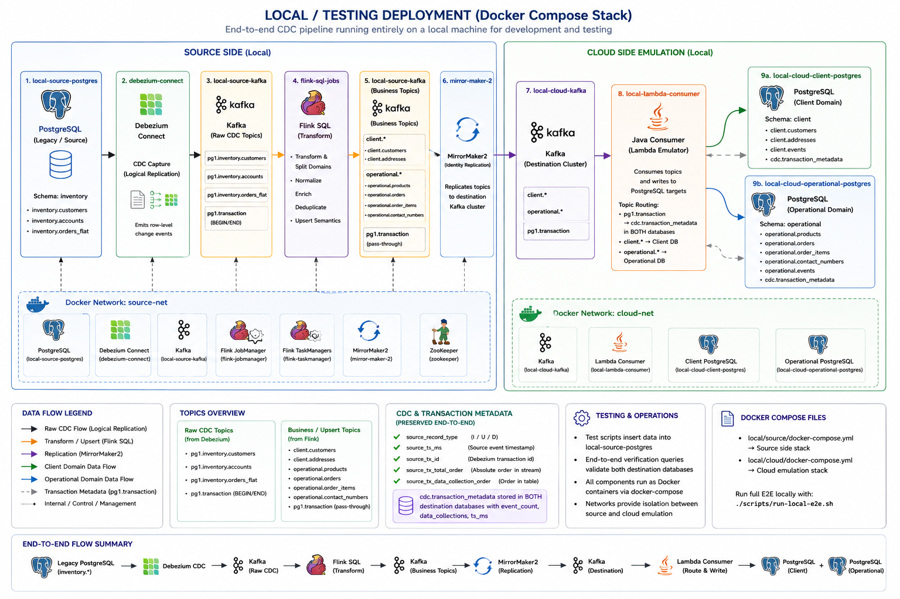

# Local Integration Assets

This directory contains shared local CDC/Flink assets used by the current migration project.

The legacy single-stack proof of concept is defined in `examples/legacy-single-stack-poc/docker-compose.yml`.

It validates the first part of the target architecture before using AWS:

```text
local legacy PostgreSQL
  -> Debezium PostgreSQL CDC connector
  -> local Kafka CDC topic
  -> Flink SQL projection job
  -> local target PostgreSQL
```

## Included Components

- PostgreSQL source with logical decoding settings.
- One-shot PostgreSQL initializer.
- Debezium PostgreSQL connector registration.
- Kafka and Zookeeper.
- Flink JobManager and TaskManager.
- Flink Kafka, JSON, JDBC, and PostgreSQL connector JARs.
- Kafka UI.
- Flink SQL source table over Debezium CDC topic.

## Ports

```text
5432  legacy PostgreSQL
5433  target PostgreSQL
8080  Kafka UI
8081  Flink UI
8083  Kafka Connect / Debezium REST API
9092  Kafka from host
```

## Start

From the repository root:

```bash
docker compose -f examples/legacy-single-stack-poc/docker-compose.yml up -d
```

The stack automatically:

1. Initializes the `inventory.customers` table.
2. Creates the Debezium replication user.
3. Registers the Debezium connector.
4. Submits the Flink SQL projection job.

## Check Status

Kafka Connect connector status:

```bash
curl -fsS http://localhost:8083/connectors/legacy-postgres-source/status
```

Flink jobs:

```bash
curl -fsS http://localhost:8081/jobs
```

Kafka topics:

```bash
docker exec -it local-kafka kafka-topics \
  --bootstrap-server kafka:29092 \
  --list
```

Kafka UI:

```text
http://localhost:8080
```

Flink UI:

```text
http://localhost:8081
```

## Verify CDC Topic

Consume the raw Debezium CDC topic:

```bash
docker exec -it local-kafka kafka-console-consumer \
  --bootstrap-server kafka:29092 \
  --topic pg1.inventory.customers \
  --from-beginning \
  --property print.key=true \
  --property print.value=true
```

## Create a Source Change

```bash
docker exec -it local-legacy-postgres psql -U postgres -d appdb \
  -c "INSERT INTO inventory.customers (id, first_name, last_name, email, status) VALUES (3, 'Carol', 'Example', 'carol@example.com', 'ACTIVE') ON CONFLICT (id) DO UPDATE SET updated_at = now();"
```

## Verify Target Projection

```bash
docker exec -it local-target-postgres psql -U appuser -d microservices \
  -c "SELECT * FROM customer_projection ORDER BY id;"
```

## Run Flink SQL Manually

If the one-shot `flink-sql-init` service fails or you change `local/flink/sql/init.sql`, run:

```bash
docker compose -f examples/legacy-single-stack-poc/docker-compose.yml run --rm flink-sql-init
```

Interactive SQL client:

```bash
docker exec -it local-flink-jobmanager /opt/flink/bin/sql-client.sh
```

## Logs

```bash
docker compose -f examples/legacy-single-stack-poc/docker-compose.yml logs --tail=200 connect
docker compose -f examples/legacy-single-stack-poc/docker-compose.yml logs --tail=200 flink-jobmanager
docker compose -f examples/legacy-single-stack-poc/docker-compose.yml logs --tail=200 flink-taskmanager
docker compose -f examples/legacy-single-stack-poc/docker-compose.yml logs --tail=200 flink-sql-init
```

## Manual Connector Recreate

The compose stack registers the connector automatically. To recreate it manually:

```bash
./local/register-connector.sh
```

If connector registration fails, inspect the one-shot container logs. They now include the Kafka Connect HTTP response body:

```bash
docker compose -f examples/legacy-single-stack-poc/docker-compose.yml logs --tail=200 dbz-init
```

## Stop

```bash
docker compose -f examples/legacy-single-stack-poc/docker-compose.yml down
```

Delete local volumes:

```bash
docker compose -f examples/legacy-single-stack-poc/docker-compose.yml down -v
```

## Current Scope

Implemented locally:

- PostgreSQL source configured for logical replication.
- Seed `inventory.customers` table.
- Debezium replication user.
- Kafka and Zookeeper.
- Debezium Connect.
- Debezium PostgreSQL source connector.
- Flink JobManager and TaskManager.
- Flink SQL CDC source and JDBC target projection.
- Target PostgreSQL with lineage columns.
- Kafka UI.

Not implemented yet:

- Schema registry.
- DLQ topics.
- Automated test assertions.
- MirrorMaker2 to AWS MSK from the local stack.
- Source LSN and transaction ID extraction into target projection.

## Two-Compose Local Migration Deployment



The split local deployment replaces the AWS side with local containers while keeping the same migration shape:

```text
source compose:
  source PostgreSQL -> Debezium CDC -> source Kafka -> Flink -> client.* and operational.* topics -> MirrorMaker2

cloud replacement compose:
  cloud Kafka -> local Lambda replacement -> client PostgreSQL + operational PostgreSQL
```

The split flow also carries Debezium transaction metadata:

- `pg1.transaction` is replicated to the cloud replacement Kafka.
- Each derived data topic includes `source_record_type`, `source_ts_ms`, `source_tx_id`, `source_tx_total_order`, and `source_tx_data_collection_order`.
- Each destination business table stores those same source metadata columns.
- `cdc.transaction_metadata` stores transaction `BEGIN` and `END` rows with `event_count`, `data_collections`, and `ts_ms` for consistency checks and orchestration.

Files:

- `local/source/docker-compose.yml`: source/on-prem emulator with PostgreSQL, Debezium, Kafka, Flink, and MirrorMaker2.
- `local/cloud/docker-compose.yml`: cloud replacement with Kafka, a Lambda-like consumer, client PostgreSQL, and operational PostgreSQL.
- `local/source/mm2.properties`: MirrorMaker2 replication from `source-kafka:29092` to `cloud-kafka:39092`.
- `local/cloud/lambda-consumer/src/main/java/com/example/local/LocalLambdaConsumer.java`: consumes `client.*` and `operational.*` topics and upserts into the matching destination database.

Start with Terraform:

```bash
terraform apply \
  -var enable_local_deployment=true \
  -target=terraform_data.local_docker_network \
  -target=terraform_data.local_cloud_deployment \
  -target=terraform_data.local_source_deployment
```

Or start directly with Docker Compose:

```bash
docker network inspect cdc-migration-local >/dev/null 2>&1 || docker network create cdc-migration-local
docker compose -f local/cloud/docker-compose.yml up -d --build
docker compose -f local/source/docker-compose.yml up -d
```

Or use the local deployment helper:

```bash
./local/scripts/start-local.sh
```

Run the local delivery test:

```bash
./local/scripts/run-local-e2e.sh
```

Reset both local compose stacks and run from a blank slate:

```bash
RESET=1 ./local/scripts/run-local-e2e.sh
```

Run component checks separately after the local stack is up:

```bash
./local/tests/test-source-postgres.sh
./local/tests/test-debezium-connect.sh
./local/tests/test-source-kafka.sh
./local/tests/test-flink.sh
./local/tests/test-mirrormaker2.sh
./local/tests/test-cloud-kafka.sh
./local/tests/test-client-postgres.sh
./local/tests/test-operational-postgres.sh
./local/tests/test-local-lambda.sh
```

Run every component check:

```bash
./local/tests/run-all-components.sh
```

Verify cloud replacement Kafka topics:

```bash
docker exec -it local-cloud-kafka kafka-topics \
  --bootstrap-server cloud-kafka:39092 \
  --list
```

Verify client PostgreSQL:

```bash
docker exec -it local-cloud-client-postgres psql -U appuser -d clientdb \
  -c "SELECT 'customers' AS table_name, count(*) FROM client.customers
      UNION ALL SELECT 'addresses', count(*) FROM client.addresses
      ORDER BY table_name;"
```

Verify operational PostgreSQL:

```bash
docker exec -it local-cloud-operational-postgres psql -U appuser -d operationaldb \
  -c "SELECT 'products' AS table_name, count(*) FROM operational.products
      UNION ALL SELECT 'orders', count(*) FROM operational.orders
      UNION ALL SELECT 'order_items', count(*) FROM operational.order_items
      UNION ALL SELECT 'contact_numbers', count(*) FROM operational.contact_numbers
      ORDER BY table_name;"
```

Stop the split local deployment:

```bash
./local/scripts/stop-local.sh
```

Delete split local volumes:

```bash
DELETE_VOLUMES=1 ./local/scripts/stop-local.sh
```
